# Yuna Ishikawa - Telegram Chatbot with Palm AI

Yuna Ishikawa is an advanced Telegram chatbot powered by [Palm AI's generative language models](https://developers.generativeai.google/). This project provides a comprehensive solution for language-related services, offering paraphrasing, summarization, detailed and simple responses, and text-to-speech capabilities. The bot is designed to interact seamlessly with users on the Telegram platform while maintaining a modular and well-organized codebase.

## Table of Contents

1. [Introduction](#introduction)
2. [Features](#features)
3. [Installation](#installation)
4. [Configuration](#configuration)
5. [Usage](#usage)
6. [Components](#components)
7. [Data Management](#data-management)
8. [Flowchart](#flowchart)
9. [Acknowledgments](#acknowledgments)

## Introduction

Yuna Ishikawa leverages the power of Palm AI's language models to offer an enhanced chatbot experience on Telegram. Users can engage with Yuna for various language-related tasks, including paraphrasing, summarization, and generating detailed or simple responses. The bot also incorporates a text-to-speech (TTS) feature, converting textual responses into audio for a more dynamic interaction. The modular structure of the codebase ensures scalability and maintainability.

## Features

### Paraphrasing

Users can request Yuna to paraphrase input text, providing a refined version while maintaining clarity and coherence.

### Summarization

Yuna can summarize input text, condensing it to a simpler and shorter form for better understanding.

### Elaboration

Users can ask Yuna to elaborate on input, generating a longer response with more details while ensuring it remains understandable.

### Detailed and Simple Responses

Yuna can provide detailed or simple responses based on user queries, catering to different information needs.

### Text-to-Speech (TTS)

Yuna offers a TTS feature, converting text responses into audio for a more dynamic user experience. Users can listen to the generated audio directly within the Telegram chat.

### Data Storage

User interactions are stored in an SQLite database, allowing retrieval of past responses. This feature enhances user experience by providing access to historical interactions.

## Installation

1. **Clone the Repository:**

    ```bash
    git clone https://github.com/1999azzar/Palm-powered-telegram-bot.git
    cd Yuna-Ishikawa
    ```

2. **Install Dependencies:**

    ```bash
    pip install -r requirements.txt
    ```

3. **Configure the Environment:**

    Create a `.env` file in the project root and provide the following key-value pairs:

    - `TELEGRAM_BOT_TOKEN`: Your Telegram Bot Token.
    - `PALM_API_KEY`: Your Palm AI API key.
    - `USER_ID`: Comma-separated list of Telegram user IDs allowed to use the bot (use '*' for unrestricted access).
    - `ADMIN_ID`: Comma-separated list of Telegram user IDs with administrative access (use '*' for unrestricted access).

4. **Run the Bot:**

    ```bash
    python bot/main.py
    ```

## Configuration

Create a .env file in the project root and set the necessary environment variables:

Configure the bot by creating a `.env` file in the project root and providing the necessary key-value pairs. This includes the Telegram Bot Token, Palm AI API key, and user access controls.

```env
TELEGRAM_BOT_TOKEN="your_telegram_bot_token"
PALM_API_KEY="your_palm_api_key"
USER_ID="allowed_user_ids_comma_separated"
ADMIN_ID="admin_user_ids_comma_separated"
```

## Usage

- `/start`: Start a conversation with Yuna and receive a welcome message.
- `/help`: Display a list of available commands and their descriptions.
- `/paraphrase [text]`: Paraphrase the provided text for a refined version.
- `/summarize [text]`: Summarize the input text to a more concise form.
- `/elaborate [text]`: Elaborate on the input text, providing more details.
- `/detailed [text]`: Request a detailed possible answer or explanation.
- `/simple [text]`: Request a simple answer or explanation (35 words max).

Interact with Yuna Ishikawa through Telegram using these commands to explore its diverse capabilities. For TTS, use the provided voice button in the inline keyboard.

## Components

### BotHandler (`bot/main.py`)

Manages the Telegram bot, user commands, and message handling. This component is the entry point for user interactions.

### Helper (`bot/helper.py`)

Provides utility functions for user authorization, translation, and TTS. The helper ensures seamless integration of these functionalities within the bot.

### Palmai (`bot/palmai.py`)

Implements the Singleton pattern for initializing and interacting with the Palm AI language models. Palmai serves as the bridge between Yuna and the powerful generative language models.

### DatabaseManager (`bot/datamanager.py`)

Handles the SQLite database for storing and retrieving user interactions. The DatabaseManager class ensures efficient storage and retrieval of user-specific data.

## Data Management

User interactions are stored in a SQLite database, with each user having a dedicated table. The `DatabaseManager` class facilitates the creation, storage, and retrieval of user-specific data, enhancing the overall user experience.

## Flowchart

The flowchart illustrates the interaction flow within the Telegram bot system. Here's a brief description of the key components and their interactions:

1. **User Cluster:**
   - The user interacts with the Telegram bot.
   - Messages and commands are sent to the Telegram Bot (`BotHandler`).

2. **Bot Cluster:**
   - The Telegram Bot (`BotHandler`) processes received messages and commands.

3. **BotHandler Cluster:**
   - Manages user authorization and interactions.
   - Forwards commands to `Palmai` for response generation.
   - Utilizes `Helper` for tasks like translation and Text-to-Speech (TTS).
   - Communicates with `DatabaseManager` for storing and retrieving user data.

4. **Palmai Cluster:**
   - Generates chat responses (`generate_chat`) and text responses (`generate_text`) based on user commands.

5. **Database Cluster:**
   - `DatabaseManager` handles data storage and retrieval using SQLite.
   - Manages user-specific tables for storing responses and language information.

6. **Flow Summary:**
   - User commands flow from the Telegram interface to the `BotHandler`.
   - `BotHandler` coordinates with `Palmai` for response generation and interacts with the database through `DatabaseManager`.
   - Responses are translated and sent back to the user via the Telegram Bot.

Overall, this flowchart encapsulates the seamless interaction between the user, the Telegram bot, and the backend components responsible for processing commands, generating responses, and managing user data.

```mermaid
graph LR;

style clusterUser fill:#4C1E1E,stroke:#2A1010,stroke-width:2px;
style clusterBot fill:#6B2E2E,stroke:#421B1B,stroke-width:2px;
style clusterBotHandler fill:#8C3E3E,stroke:#5F2828,stroke-width:2px;
style clusterPalmai fill:#B45A5A,stroke:#844040,stroke-width:2px;
style clusterDatabase fill:#E36B6B,stroke:#C04C4C,stroke-width:2px;

subgraph clusterUser
  A[User] -->|Interacts with Telegram| B[Telegram Bot]
end

subgraph clusterBot
  B -->|Receives messages/commands| C[BotHandler]
end

subgraph clusterBotHandler
  C -->|Processes messages and commands| D[Helper]
  D -->|Manages user authorization and interactions| E[Palmai]
  E -->|Handles translation and TTS| F[DatabaseManager]
end

subgraph clusterPalmai
  E -->|Generates chat responses| G[Palmai.generate_chat]
  E -->|Generates text responses| H[Palmai.generate_text]
end

subgraph clusterDatabase
  F -->|Manages data storage and retrieval| I[SQLite Database]
end

B -->|User sends command| C
C -->|Identifies command type and user ID| D
D -->|Manages user authorization and interaction| E
E --> F
F -->|Manages data storage and retrieval| I
I -->|Stores and retrieves user data| F

C -->|Processes /start command| J[BotHandler.start]
J -->|Sends welcome message| B

C -->|Processes /help command| K[BotHandler.help_command]
K -->|Displays command list and descriptions| B

C -->|Processes /paraphrase command| L[BotHandler.paraphrase]
L -->|Handles user input and interacts with Palmai| E
E -->|Generates paraphrased response| G
G -->|Translates and sends response| B

C -->|Processes /summarize command| M[BotHandler.summarize]
M -->|Handles user input and interacts with Palmai| E
E -->|Generates summarized response| G
G -->|Translates and sends response| B

C -->|Processes /elaborate command| N[BotHandler.elaborate]
N -->|Handles user input and interacts with Palmai| E
E -->|Generates elaborate response| G
G -->|Translates and sends response| B

C -->|Processes /detailed command| O[BotHandler.detailed]
O -->|Handles user input and interacts with Palmai| E
E -->|Generates detailed response| G
G -->|Translates and sends response| B

C -->|Processes /simple command| P[BotHandler.simple]
P -->|Handles user input and interacts with Palmai| E
E -->|Generates simple response| G
G -->|Translates and sends response| B
```



## Acknowledgments

Yuna Ishikawa utilizes the Palm AI language models, and special thanks are extended to the developers and contributors of Palm AI. The collaboration enables the creation of a sophisticated and user-friendly chatbot experience.

Feel free to explore and enhance the capabilities of Yuna Ishikawa for your language-related needs! If you encounter any issues or have suggestions, please open an issue on the repository. Contributions are welcome!
