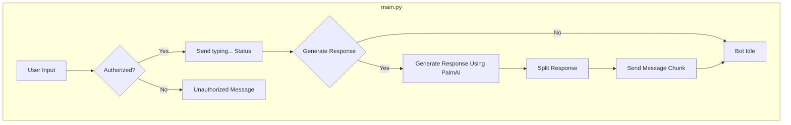

# bard-powered-telegram-bot

This repository contains code for a chatbot implemented in Python using the Telegram Bot API. The chatbot is designed to respond to user messages and provide assistance based on the input.

Here, there are three iterations of the bot:

- [Standard](https://github.com/1999AZZAR/Palm-powered-telegram-bot/tree/master/standart) (get model automatically)
- [Chat model](https://github.com/1999AZZAR/Palm-powered-telegram-bot/tree/master/trained/chat-byson) (chat-byson tuned)
- [Text mode](https://github.com/1999AZZAR/Palm-powered-telegram-bot/tree/master/trained/text-byson) (text-byson tuned)

You can use any model as you wish.

## Prerequisites

To run the chatbot, ensure you have the following:

1. Python 3.7 or above installed on your machine.
2. `python-telegram-bot` library. Install it using `pip install python-telegram-bot`.
3. A Telegram bot token. You can obtain one by creating a new bot through the BotFather on Telegram. Note down the bot token for later use.

## Installation

1. Clone the repository to your local machine or download the source code.
2. Install the required dependencies by running `pip install -r requirements.txt` in the project directory.
3. Set up environment variables:
   - Create a `.env` file in the project directory.
   - Add the following variables to the `.env` file:

    ```text
    PALM_API_KEY=<your_palm_api_key> 
    TELEGRAM_BOT_TOKEN=<your_telegram_bot_token> # your telegram bot api from @botfather
    USER_ID=<your_user_id> # use comma for separation if u have more than 1 user
    ```

   - Replace `<your_bard_token>` with the token for your Bard chatbot
   - Replace `<your_telegram_bot_token>` with the token for your Telegram bot.
   - Replace `<your_user_id>` your Telegram user ID, u can use comma for separation if u want to be able using it with multiple user or simply replace with `*` if u want to disable the user auth process.
4. Run the chatbot by executing `python bot/main.py`.

5. (optional) if u use my tuned model u can add this preset command to the bot using the @botfather, here the steps :

   - use `/mybot` command on botfather
   - select the bot u want to edit
   - select `edit bot`
   - select `edit command`
   - send this to botfather :

```text
createch - Enter Createch Mode. 
research - Enter Researcher Assistant Mode. 
paraphrasing - Enter Paraphrasing Mode. 
iomutation - Enter IO Mutation Mode. 
normal - Enter Normal Chat Mode. 
detailed - Ask for detail answer.
simple - Ask for simple answer.
start - Start Conversation with Yuna Ishikawa. 
reset - Reset Yuna Ishikawa for re-initialization. 
help - List All Commands
```

## File Structure

The repository has the following structure:

```text
bot/
  ├── palmai.py
  ├── helper.py
  ├── main.py
.env
requirements.txt
```

or

```text
palmai.py
helper.py
main.py
.env
requirements.txt
```

- `palmai.py`: Contains the implementation of the [`palm`](https://makersuite.google.com/app/apikey) class, which initializes the chatbot and processes user input to generate responses.
- `helper.py`: Provides a helper function `is_user` to check if a user is authorized to use the bot.
- `main.py`: The main file that sets up the Telegram bot, handles incoming messages, and triggers the chatbot for generating responses.
- `.env`: All the key and secret data that are important for the bot to run and initialize correctly..

## Flowchart



## Usage

1. Start the bot by running `python main.py`.
2. Open the Telegram app and search for your bot using the username you assigned to it during creation.
3. Start a chat with the bot and interact with it by sending messages.
4. The bot will process your input and provide a response based on the implemented logic.
5. You can use the `/start` command to initiate a conversation with the bot.
6. If you need to reset the chat history, you can use the `/reset` command.

Note: The bot will only respond to authorized users whose Telegram user ID matches the one specified in the `.env` file.

## Customization

You can customize the behavior and responses of the chatbot by modifying the code in `palmai.py`. You can add new functionalities or change the logic to suit your requirements. Even you can change the model as you wish, and you can learn more about Palm 2 [here.](https://developers.generativeai.google/products/palm) and the models [here.](https://cloud.google.com/vertex-ai/docs/generative-ai/learn/models)

## Contribution

Contributions to the project are welcome. If you encounter any issues or have suggestions for improvement, please submit an issue or a pull request to the repository.

## Acknowledgements

The code in this repository was developed based on the Python-Telegram-Bot library and follows best practices for Telegram bot development.

If you have any questions or need further assistance, please don't hesitate to reach out. Enjoy using the chatbot!
